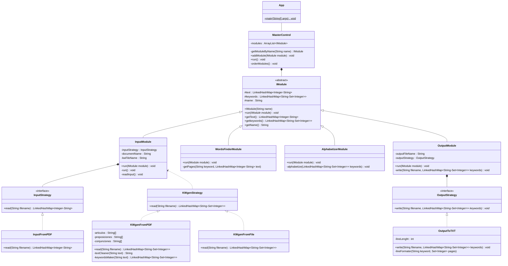

# GlossaryKWIC_ADT

```mermaid
classDiagram

    class MasterControl{
        -modules : ArrayList~IModule~
        -getModuleByName(String name) IModule
        +addModule(IModule module) void
        +run() void
        -orderModules() void
    }

    class IModule{
        <<abstract>>
        #text : LinkedHashMap~Integer-String~
        #keywords : LinkedHashMap~String-Set~Integer~~
        #name : String
        +IModule(String name)
        +run(IModule module)* void
        +getText() LinkedHashMap~Integer-String~
        +getkeywords() LinkedHashMap~String-Set~Integer~~ 
        +getName() String
    }
    class InputModule{
        -inputStrategy : InputStrategy
        -documentName : String
        -kwFileName : String
        +run(IModule module) void
        -run() void
        -readInput() void
    }

    
    class WordsFinderModule{
        +run(IModule module) void
        -getPages(String keyword, LinkedHashMap~Integer-String~ text)
    }

    class AlphabetizerModule{
        +run(IModule module) void
        -alphabetize(LinkedHashMap~String-Set~Integer~~ keywords) void
    }

    class OutputModule{
        -outputFileName : String
        -outputStrategy : OutputStrategy
        +run(IModule module) void
        -write(String filename, LinkedHashMap~String-Set~Integer~~ keywords) void
    }


    class InputStrategy{
        <<interface>>
        +read(String filename)* LinkedHashMap~Integer-String~

    }

    class InputFromPDF{
        +read(String filename) LinkedHashMap~Integer-String~
    }

    
    class OutputStrategy{
        <<interface>>
        +write(String filename, LinkedHashMap~String-Set~Integer~~ keywords )* void
    }
    class OutputToTXT{
        -lineLenght : int
        +write(String filename, LinkedHashMap~String-Set~Integer~~ keywords ) void
        -lineFormater(String keyword, Set~Integer~ pages)
    }

    class KWgenStrategy{
        +read(String filename)* LinkedHashMap~String-Set~Integer~~
    }
    class KWgenFromPDF{
        -articulos : String[]
        -preposiciones : String[]
        -conjunciones : String[]
        +read(String filename) LinkedHashMap~String-Set~Integer~~
        -textCleaner(String text) String
        -keywordsMaker(String text) LinkedHashMap~String-Set~Integer~~
    }

    class KWgenFromFile{
        +read(String filename) LinkedHashMap~String-Set~Integer~~
    }

    class App{
        +main(String[] args)$ void
    }

    App -- MasterControl
    MasterControl *-- IModule
    
    IModule <|-- InputModule
    IModule <|-- AlphabetizerModule
    IModule <|-- WordsFinderModule
    IModule <|-- OutputModule
    

    OutputStrategy <|.. OutputToTXT
    InputStrategy <|.. InputFromPDF

    KWgenStrategy <|.. KWgenFromPDF
    KWgenStrategy <|.. KWgenFromFile

    OutputModule *-- OutputStrategy
    InputModule *-- InputStrategy

    InputModule<.. KWgenStrategy


```
