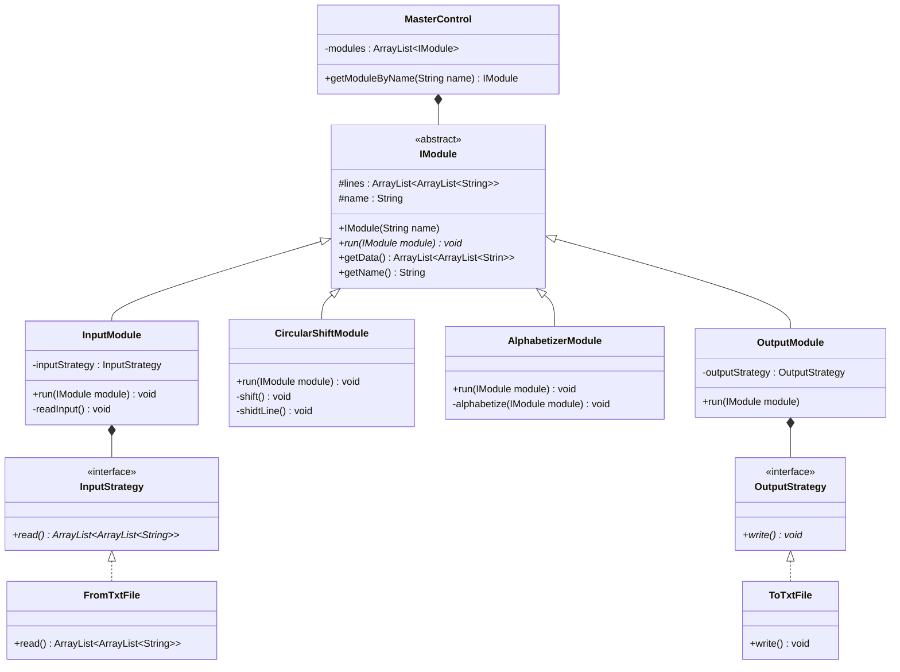

# GlossaryKWIC_ADT
# GlossaryKWIC
 

```mermaid
classDiagram

    class MasterControl{
        -modules : ArrayList~IModule~
        +getModuleByName(String name) IModule
    }

    class IModule{
        <<abstract>>
        #lines : ArrayList~ArrayList~String~~
        #name : String
        +IModule(String name)
        +run(IModule module)* void
        +getData() ArrayList~ArrayList~Strin~~
        +getName() String


    }
    class InputModule{
        -inputStrategy : InputStrategy
        +run(IModule module) void
        -readInput() void
    }

    class CircularShiftModule{
        +run(IModule module) void
        -shift() void
        -shidtLine() void
    }
    class AlphabetizerModule{
        +run(IModule module) void
        -alphabetize(IModule module) void
    }


    class InputStrategy{
        <<interface>>
        +read()* ArrayList~ArrayList~String~~
    }

    class FromTxtFile{
        +read() ArrayList~ArrayList~String~~
    }

    class OutputModule{
        -outputStrategy : OutputStrategy
        +run(IModule module)
    }
    class OutputStrategy{
        <<interface>>
        +write()* void
    }
    class ToTxtFile{
        +write() void
    }

    MasterControl *-- IModule
    
    IModule <|-- InputModule
    IModule <|-- CircularShiftModule
    IModule <|-- AlphabetizerModule
    IModule <|-- OutputModule
    

    OutputStrategy <|.. ToTxtFile
    InputStrategy <|.. FromTxtFile

    OutputModule *-- OutputStrategy
    InputModule *-- InputStrategy


```
